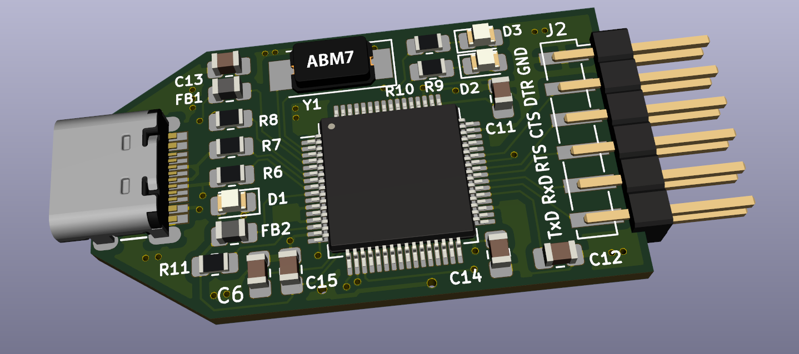

# FT2232HL-jtag-clone

Digilent JTAG clone hardware + eeprom firmware (.bin). Support dual port, JTAG + Serial TTL. Hardware design using KiCad. 

## Pinout FT2232HL

JTAG:

| Pin FT2232HL | JTAG Name | FT2232 Name |
|:------------:|:---------:|:-----------:|
| 16           | TCK       | ADBUS0      |
| 17           | TDI       | ADBUS1      |
| 18           | TDO       | ADBUS2      |
| 19           | TMS       | ADBUS3      |

Serial UART:

| Pin FT2232HL | JTAG Name | FT2232 Name |
|:------------:|:---------:|:-----------:|
| 38           | TXD       | BDBUS0      |
| 39           | RXD       | BDBUS1      |

### How To Flash EEPROM

[how-to-flash](https://github.com/vanbwodonk/ft2232hl-jtag-clone/blob/main/eeprom_binary/README.md)

### Source :

Thanks to @rikka0w0 for provide binary files modification .Source : https://gist.github.com/rikka0w0/24b58b54473227502fa0334bbe75c3c1
